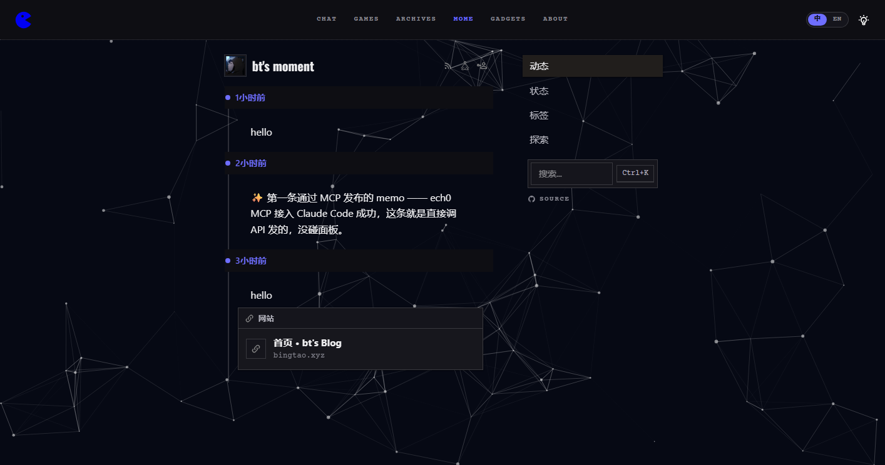
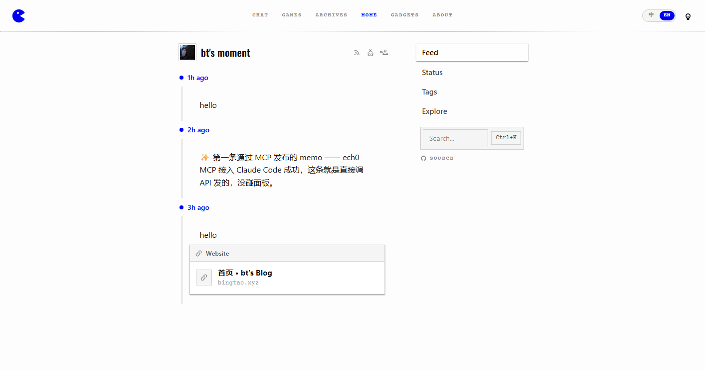

# bt's moment

**给 [Ech0](https://github.com/lin-snow/Ech0) 换一层皮：纸面 + 墨色 + 吃豆人。**

一套运行时主题（一段 CSS + 一段 JS，通过面板注入，不改 Ech0 源码），
外加可选的加载页改写与 systemd/反代部署示例。

> **English abstract** — *bts-moment* is a runtime theme kit for
> [Ech0](https://github.com/lin-snow/Ech0), a self-hosted single-user microblog
> written in Go + Vue. It injects a flat paper-and-ink skin plus a clone of the
> companion blog's header (pacman → home, centered nav, language pill, light
> switch) through Ech0's built-in *Custom CSS / Custom JS* settings — no source
> changes, no rebuild. It also ships a self-contained particle wallpaper page,
> optional nginx/Cloudflare-Worker snippets that restyle the pre-Vue loading
> screen, and a hardened systemd unit. Licensed AGPL-3.0-or-later, matching
> upstream.

---

## 目录

- [这是什么](#这是什么)
- [长什么样](#长什么样)
- [装法](#装法)
- [配置](#配置)
- [设计说明](#设计说明)
- [部署套件](#部署套件)
- [已知限制](#已知限制)
- [合规](#合规)
- [许可与致谢](#许可与致谢)

---

## 这是什么

Ech0 是一个自托管的单人微博客：Go 写的单文件二进制，前端是 Vue 3 + UnoCSS，
前端资源用 `//go:embed` 烘进二进制里。它自带两个口子 —— **自定义 CSS** 和
**自定义 JS** —— 允许你在不碰源码的前提下换掉整站外观。

**bts-moment 就是往这两个口子里塞的东西。** 具体地：

| | |
|---|---|
| **它是什么** | Ech0 的一个第三方主题 + 一套部署套件 |
| **它不是什么** | 不是 Ech0 的 fork，不含 Go / Vue 源码，不含二进制 |
| **怎么生效** | 面板 → 系统设置 → 自定义 CSS / 自定义 JS |
| **改了什么** | 只加样式和客户端脚本；Ech0 一行源码都没动 |
| **许可** | AGPL-3.0-or-later（跟上游一致，见 [NOTICE](NOTICE)） |

皮肤的来路很直白：它**是配套博客（[bingtao.xyz](https://bingtao.xyz)）那一套的复制品**。
配色、字体、顶栏、开关灯、语言药丸，全部照抄博客的 `src/styles/global.css` 与
`Base.astro`，数值都写在注释里。所以这套东西可以一句话概括：

> **Ech0 的骨架 + 博客的皮肤。**

没有玻璃、没有 `backdrop-filter`、没有半透明填充 —— 面板就是实心纸面，
唯一的装饰是 `1px dotted` 的虚线和粒子壁纸。

---

## 长什么样

**暗色（默认）** —— 纸面变墨色，粒子壁纸透在正文后面：



**亮色** —— 干净的纸，粒子收起：


**英文** —— 右上角点一下 `EN`，界面当场变英文（不用刷新）：



两套颜色的分工是刻意的，全部来自博客的 token：

| | 暗色 | 亮色 |
|---|---|---|
| 纸面 | `#0e0e13` 近黑 | `#fdfdfd` 近白 |
| 主色 | `#6e6eff` | `#0000f2` |
| 虚线 | `#3a3a44` | `#c9c9c9` |
| 粒子壁纸 | 开（`display:block`） | 关（`display:none`） |

> 亮色**刻意不挂粒子**。博客那边就是这样的：亮色的稿纸上撒一把发光的点是脏的。

---

## 装法

### 最小可用（三步，五分钟）

**1. 字体**

把 `fonts/` 整个目录放到你站点的根目录下，让它能通过
`https://你的域名/fonts/oswald-var.woff2` 访问到。

> 仓库里的 `theme/custom.css` 是按 `/fonts` 这个路径构建的。
> 想放别处，或者想直接外链别人的（需要对方带 CORS），
> 用 `python theme/src/build.py <你的字体目录URL>` 重新构建一份。

**2. 注入 CSS 和 JS**

打开 Ech0 面板 → **系统设置**：

- 「自定义 CSS」← 粘贴 `theme/custom.css` 的全文
- 「自定义 JS」← 粘贴 `theme/custom.js` 的全文

保存，刷新。这一步做完主题就已经生效了。

**3. 粒子壁纸（可选）**

`extras/bg-particle/` 是一个自包含的粒子页面。把它整个目录丢到任意
静态站点上（跟 Ech0 同域或跨域都行），然后改 `custom.js` 顶部的配置：

```js
particleUrl: 'https://你的静态站/bg-particle/index.html',
```

不想挂粒子就留空字符串 `''`，主题在暗色下就只是一块纯色底，其余照常。

### 顶栏那几张图

顶栏左边那个**吃豆人**、右上角那**两张灯泡**，都是图片，不在仓库里 ——
`CONFIG.home.icon` 和 `CONFIG.themeIcons` 现在是占位路径，得换成你自己的图。
（吃什么豆人是个人口味，所以留给你自己配；`screenshots/` 里那几个是作者的。）

两条要求：

- 灯泡两张都应该是**深色线条图**。暗色下脚本会给它加 `filter: invert(1)` 翻白 ——
  跟博客那段 `setTheme()` 是同一个做法，所以**不要**自己准备一张白色的。
- 图标务必是**正方形 SVG**。它是按固定 `20px` 摆的，宽高不等的图会歪。

### 完整一点

再往下还有两件可选的：

- **加载页改写** —— Ech0 的加载页（笑脸 + "Ech0"）写死在二进制里，
  `custom_css` / `custom_js` 都够不着它（那两个要等 Vue 挂载）。想改就得
  在 HTML 出站前动手。→ 见 [`deploy/`](#部署套件)
- **systemd 服务** —— 一个跑在非特权用户下、带 systemd 加固的单元文件。

---

## 配置

**你要改的东西全在 `theme/custom.js` 顶部的 `CONFIG` 里：**

```js
var CONFIG = {
  // 粒子壁纸地址。留空则完全不挂粒子。
  particleUrl: '/bg-particle/index.html',

  // 顶栏六栏目。换成你自己站点的真实路径；少放几个就删行；
  // 留空数组 [] 则整个栏目区不出现。
  nav: [
    { label: 'Chat',     href: '/chat/' },
    { label: 'Games',    href: '/games/' },
    { label: 'Archives', href: '/archives/' },
    { label: 'Mome',     href: '/' },
    { label: 'Gadgets',  href: '/radio/' },
    { label: 'About',    href: '/about/' }
  ],

  // 顶栏左边那个标志（吃豆人），点了回主站首页。
  home: { href: '/', icon: '/pacman.svg' },

  // 右上角开关灯的图标：亮色用 light、暗色用 dark。两张都要深色线条图。
  themeIcons: { light: '/off.svg', dark: '/on.svg' },

  // 右上角语言药丸。code 是 Ech0 自己的语言代码（存在 localStorage.locale），
  // name 必须逐字等于 Ech0 语言菜单里那一项。
  locales: [
    { code: 'zh-CN', label: '中', name: '简体中文' },
    { code: 'en-US', label: 'EN', name: 'English' }
  ],

  // 侧栏底部那行 `version: x.y.z` 改成指向你自己那份主题仓库的源码入口。
  // 留空则整行藏掉（也就是不启用）。见「合规」。
  sourceUrl: '',

  // 首次访问落到哪套主题：'dark' 或 'light'
  defaultTheme: 'dark'
}
```

上面是仓库里的**占位路径**，记得换成你自己的。
顶栏当前页会自动高亮，SPA 站内跳转也会跟着更新（脚本打了
`pushState` / `replaceState` 补丁，不轮询）。

### 关于语言

Ech0 自带 i18n（简体中文 / English / Deutsch / 日本語），但**它没有基于路径的
语言路由** —— `/en/` 是 404。语言是客户端状态，存在 `localStorage.locale` 里。

所以这里的做法是：顶栏那个药丸**去点 Ech0 自己的语言菜单**（原生那个被藏起来了，
但程序化点击照样生效），点完界面当场就变，不用刷新。两侧：

- **要一个能分享的英文链接**：`https://你的站/?lang=en`。脚本读到这个参数会
  直接落到英文界面，并且用 `replaceState` 把参数抹掉（免得跟刷新打架）。
  别名 `zh` / `en` 也认。
- **要一个真正的 `/en/` 路径**：那得改 Ech0 源码加路由，不在这个主题的能力范围内。

`locales` 数组里的 `name` 要**逐字**对上 Ech0 菜单里的显示名（就是
`简体中文` / `English` / `Deutsch` / `日本語` 那几项），因为脚本是靠文本去找那一项、
再点它的。对不上会**退回**「写 localStorage + 刷新页面」的兜底路径 ——
效果一样，只是整页会闪一下。加语言就往数组里加一行。

### 改样式

想改颜色、间距这些，要动 `theme/src/`：

```
theme/
├─ custom.css        ← 构建产物。**别手改**，会被下次构建覆盖
├─ custom.js         ← 手写，直接改
└─ src/
   ├─ tokens.css     ← 所有色值，按 /* ===== 2.x */ 分节
   ├─ tail.css       ← 第 3 节往后的所有规则（都走 var()，明暗自动跟）
   └─ build.py       ← tokens + tail → custom.css
```

改完重新构建：

```bash
python theme/src/build.py                  # 字体走 /fonts
python theme/src/build.py https://cdn.example.com/fonts   # 字体走外链
```

`build.py` 干的事很简单：把 `tokens.css` 里那**一个** `:root:root { }` 块
按节拆开 —— 字体和圆角那两节明暗共用，其余（都是暗色值）按一张固定的映射表
机械生成亮色版 —— 再拼上 `tail.css`，输出三段式：

```css
:root:root                        { /* 字体、圆角 —— 与主题无关 */ }
:root:root.dark                   { /* 暗色 */ }
:root:root.light, :root:root.sunny { /* 亮色，由暗色机械映射而来 */ }
```

构建是**可重复**的：同一个输入跑多少次，输出的 bytes 都一样。
亮色块是生成的，所以**不要手改 `custom.css`** —— 改 `tokens.css`，
或者改 `build.py` 里的 `PALETTE`。

---

## 设计说明

这一节解释「为什么是这样写的」。如果你只是想用，可以跳过。

### 为什么通篇都在改 CSS 变量

Ech0 的前端是 UnoCSS 原子类。翻它编译出来的主 CSS（v5.7.0 那份
`index-*.css`，约 100 KB）：一共只有 **412 个类名 token**，其中真正语义化的
组件类只有 `.widget` / `.x-scrollbar` / `.route-progress__bar` 三个 ——
其余全是 `text-sm` `bg-surface` `rounded-lg` 这种。**按类名写样式是写不动的。**

唯一的杠杆是变量：原子类最终都会落到 `--color-*` / `--radius-*` /
`--font-*` 上。所以主题的主体是「盖变量」，选择器只用在变量够不着的地方。

变量盖不到的地方有两类：

1. **裸写在规则里的字面值。** 主 CSS 里一共 499 处颜色字面量 ——
   464 处在变量定义里（那些正是我们盖掉的），15 处是 `var()` 的 fallback，
   真正裸写在规则里的只有 20 处。
2. **懒加载 chunk。** HomeView / EchoView / TheMdEditor / floating-vue 的样式
   主 CSS 里一行都没有，全在各自的 chunk 里，颜色和圆角都是不走变量的字面值。
   `--md-*`（Markdown 渲染与编辑器）、`--comment-*`（评论区）、
   `--heatmap-*`（热力图）都属于这一类。

第二类只能逐个点名，也是 `custom.css` 篇幅最大的部分。

> 顺带一提：**浮层类**（用户菜单 / 语言菜单的下拉）在 Ech0 里
> 是写死的白底黑字，暗色站里点一下会弹出一个白框。这是最扎眼的一处，
> `tail.css` 第 4 节专门修了它。

### 三档字体

排版系统只有三条规则，照搬配套博客的：

| 角色 | 字族 | 规格 | 用在哪 |
|---|---|---|---|
| **标题** | Oswald | 600，`letter-spacing .01em` | `h1`–`h4`、页面标题、Markdown 标题 |
| **微标签** | Courier Prime | 700 + `uppercase` + `letter-spacing .12em` | 顶栏、时间戳、标签名、按钮、设置项名 |
| **正文** | 系统方体 | — | echo 正文、编辑器、输入框 |

第三条是刻意的：**正文保持系统字体**。等宽字体只用在「微标签」那一档 ——
它负责气质，正文负责能读。中文正文尤其不能用 Oswald / Courier Prime，
它们没有汉字，会掉到 fallback 上去。

### 顶栏

元素由 `custom.js` 注入，样式在 `tail.css` 第 9 节。它是博客 `.wm-header`
的克隆：左边吃豆人（回主站）、中间六栏目**绝对居中**、右边语言药丸 + 开关灯。
四个坑：

1. **必须自己抬层。** 粒子 iframe 是 `position:fixed; inset:0; z-index:1`，
   它的 `body` 是不透明的 `#060914` —— 暗色下它就是一块盖住整个视口的深色板。
   普通文档流里的元素 `z-index` 是 `auto`，会被它整个盖住。（亮色下粒子是
   `display:none`，所以**只在暗色里消失**，特别容易看漏。）顶栏给 `z-index: 100`。

2. **用 sticky，不用 fixed。** 博客顶栏是 fixed 的，但 Ech0 顶上已经有自己的
   header，还有一堆整屏浮层（`.palette`、`.chat-launcher`、v-popper 的下拉）——
   再来一个 fixed 的高层要挨个去躲，很容易压到东西。sticky 同样是常驻顶部，
   却仍然待在文档流里：不用给 `#app` 补 padding，也不会盖住任何浮层。

3. **Ech0 原生的主题键和语言键不能按类名一刀切。** `.home-header__link-icon`
   是个通用类名，RSS / 进入禅模式 / 切换主题 / 登录四个按钮**都挂着它**，
   按类名藏会连带干掉三个不相干的。所以 `custom.js` 里是逐个认
   `aria-label`、认出来打上 `.bt-native`，再由 CSS 收掉；认不出来就不动它。
   （这是「顶栏换了但 RSS 没了」这类事故的来源。）

4. **两栏的层内关系照抄博客。** 博客是 `#wm-particle(-1)` / `.wm-header(100)`，
   这里保持一致。

### 主题为什么被「接管」

Ech0 原生是 **三态循环**：`light → sunny → dark → light`。而这里只有明暗两套
（`sunny` 在 CSS 里被归到了亮色那套），照原样点就会出现「点一下没反应」的
中间态。所以 `custom.js` 直接接管了主题按钮：自己写 class 和 `localStorage`，
绕过它那个 store —— 存进去的仍是 `themeMode` 这个 key，所以刷新后
Ech0 读到的就是我们设的那套。

代价写在代码注释里了：store 里的内存态会和 DOM 不同步。但因为所有点击都被
拦下了，它的 `toggleTheme` 永远不会再跑，所以不会打架。
如果哪天 Ech0 改了按钮的 `aria-label`，这段会静默失效并退回原生三态 ——
不会坏，只是多一个空档。

---

## 部署套件

`deploy/` 下三个文件，**都是可选的**，都用 `__占位符__`，用之前全局替换。

### `nginx.conf.example` —— 改写加载页

解决的是一件 `custom_css` 够不着的事：Ech0 的加载页写死在 `web/index.html`
里，被 `//go:embed` 烘进了二进制；它的样式也是那段内联 `<style>`，
所以**第一帧**画出来就是它。而自定义 CSS/JS 要等 Vue 挂载之后才注入 ——
改不到第一帧。只有在 HTML 出站之前动手。

用 nginx 的 `sub_filter` 做三处替换：加载页内容、加载页样式、`<title>`。

文件里记了几条踩过的坑，最重要的一条是：

> **`proxy_set_header` 不跨层级合并。** 只要某个 `location` 里出现了任意一条
> `proxy_set_header`，server 级别的那一组就**整组失效**、不再继承 ——
> `Host` / `X-Real-IP` 全没了，上游拿到的是错的 Host，表现得很像
> 「sub_filter 没生效」，其实是这里。

需要 nginx 编译了 `http_sub_module`（Debian/Ubuntu 官方包和 `nginx:alpine`
都自带）。

### `worker.js` —— 同一件事的 Cloudflare 版

用 `HTMLRewriter` 在边缘改写，功能比 nginx 那份还多一点（顺带改
`og:title` / `theme-color` / Atom 标题）。**和 nginx 那份二选一，别同时上**
（会各改一遍）。

### `ech0.service` —— systemd 单元模板

一个跑在非特权用户下、带 systemd 加固的单元文件
（`ProtectSystem=strict` + `ReadWritePaths`、`CapabilityBoundingSet=` 清空等）。

里面特别写了一条：**别指望用 `IPAddressDeny` / `IPAddressAllow` 来封端口** ——
那会把本机回源（`nginx -> 127.0.0.1:6277`）一起弄坏。Ech0 默认绑**所有网卡**，
封端口是防火墙/安全组的活。

---

## 已知限制

- **只对 Ech0 v5.7.0 验证过。** 主题大量依赖 Ech0 的类名和 CSS 变量。
  Ech0 升级后如果改了变量名，部分样式会静默失效（不会把站弄坏，
  只是变回原版配色）。`tail.css` 第 3 节往后的类名都是语义化的、
  不带 scoped 的 `data-v` 哈希，所以那部分相对抗升级。
- **Ech0 只有明暗两态可用。** 它的 `sunny` 主题被归到了亮色那套，
  想要第三套配色得改 `build.py` 的 `PALETTE`。
- **没有 `/en/` 路径。** Ech0 没有基于路径的语言路由，见[关于语言](#关于语言)。
  能给你的是「当场切换」和 `?lang=en` 两种。
- **原生语言菜单被藏起来了。** 语言真要加到四种以上，那个药丸会变宽，
  可能得顺手调 `tail.css` 第 9 节的 `.bt-lang` 尺寸。
- **粒子壁纸是 iframe，不是 canvas。** 好处是跟主站完全隔离、零耦合；
  代价是每个页面多一个跨源请求，以及上面说的那个 `z-index` 坑。
  不想要就配 `particleUrl: ''`。
- **`extras/bg-particle/index.html` 里有一处 `img/github.svg` 的引用**，
  那个文件不在仓库里。粒子形状配的是 `circle`，这条分支永远不会走到，
  留着只是因为它是上游模板的原样。
- **字体只带了拉丁字形。** Oswald 和 Courier Prime 都没有汉字，
  中文会掉到系统字体 —— 这是设计如此（见[三档字体](#三档字体)）。
- **顶栏那几张图不在仓库里**（吃豆人、两张灯泡），得自己配，
  见[顶栏那几张图](#顶栏那几张图)。

---

## 合规

本仓库以 **AGPL-3.0-or-later** 发布（见 [LICENSE](LICENSE)）。
选它而不是 MIT，是因为它是专为 Ech0 写的衍生作品，跟上游一致最省事。

AGPL §13 要求：**通过网络与它交互的用户，必须能拿到对应源码。**
跑这套主题对外提供服务的人，需要提供一个源码链接。

主题给这个要求留了一个现成的落点：Ech0 主页侧栏底部那行
`version: x.y.z`（它原本就指向上游），会被改造成「图标 + `SOURCE`」的入口。
把 `CONFIG.sourceUrl` 填成你自己那份主题仓库的地址即可：

```js
sourceUrl: 'https://github.com/你的名字/你的主题仓库',
```

**不填就整行藏掉**，跟没有这个功能时一样。

> 顺带说一句：那行是 Ech0 **唯一**一条指向上游的链接。主题把它改指向了
> **这份主题**，而不是上游 Ech0 —— 因为 §13 要的是「访问者能拿到他正在交互的
> 这一版源码」。上游的出处在上面的 `NOTICE` 里写清楚了。
>
> 你自己那份 fork 如果也改了主题，记得 `sourceUrl` 要指向**你自己**的仓库。

`NOTICE` 里有完整的修改声明（§5(a) 要求）和第三方组件清单。

---

## 许可与致谢

- 本仓库：**AGPL-3.0-or-later**
- [Ech0](https://github.com/lin-snow/Ech0) — L1nSn0w and contributors，AGPL-3.0
- 皮肤照搬自配套博客 [bingtao.xyz](https://bingtao.xyz)（同作者）的
  `src/styles/global.css` 与 `Base.astro`
- Oswald / Courier Prime — SIL OFL 1.1（[fonts/](fonts/)）
- particles.js — Vincent Garreau，MIT
- 侧栏那个 `SOURCE` 用的 github 图标 — Material Design Icons（Pictogrammers），Apache-2.0
- 加载页那个转圈图标 — EOS Icons（SUSE UX/UI team），MIT

作者：[@yahoofunny](https://github.com/yahoofunny) ·
线上实例：[mome.bingtao.xyz](https://mome.bingtao.xyz)
